# Gangnam ST-FQI Implementation Walkthrough

I have implemented a Reinforcement Learning simulation for the Gangnam intersection using **ST-FQI (Support-Thresholded Fitted Q-Iteration)**, matching the setup from your groupmates' reference file.

## Components Implemented

### 1. Custom Environment Utils (`sumo_rl/gangnam_utils.py`)
- **Observation**: `[queue_length, arrival_count, neighbor_pressure]`
- **Reward**: `-queue_length * cycle_length`
- Matches the reference `QueueEnv` logic but adapted for SUMO.

### 2. Data Collection (`sumo_rl/collect_data.py`)
- Runs the SUMO simulation with a random policy to collect transitions `(s, a, r, s')`.
- Saves data to `gangnam_data_{ts_id}.csv`.
- **Usage**:
  ```bash
  python3 sumo_rl/collect_data.py -seconds 86400
  ```

### 3. Training (`sumo_rl/train_fqi.py`)
- Implements the **ST-FQI** algorithm using `RandomForestClassifier` (Behavior Model) and `ExtraTreesRegressor` (Q-Function).
- Loads the collected CSV data and trains a model for each intersection.
- Saves trained models to `models/fqi_model_{ts_id}.joblib`.
- **Usage**:
  ```bash
  python3 sumo_rl/train_fqi.py
  ```

### 4. Evaluation (`sumo_rl/evaluate_fqi.py`)
- Loads the trained models and runs the SUMO simulation.
- Agents query the models to select actions (Greedy with support threshold).
- **Usage**:
  ```bash
  python3 sumo_rl/evaluate_fqi.py -seconds 86400
  ```

## Verification Results
I ran a verification pipeline with a short duration (200s):
1.  **Data Collection**: Successfully generated CSV files for all intersections.
2.  **Training**: Successfully trained ST-FQI models.
    - *Note*: Some intersections had only 1 action available (fixed phase), so the model learned from single-class data.
3.  **Evaluation**: Successfully ran the simulation with the trained agents.
    - Observed negative rewards for busy intersections (e.g., `8555608441`), indicating the reward function is working.

## Visualization
To visualize the improvement, I compared the FQI agent against a random baseline.

### 1. Generate Baseline Data
```bash
python3 sumo_rl/evaluate_fqi.py -seconds 86400 --baseline
```
This generates `gangnam_eval_baseline_conn0_run1.csv`.

### 2. Generate FQI Data
```bash
python3 sumo_rl/evaluate_fqi.py -seconds 86400
```
This generates `gangnam_eval_conn0_run1.csv`.

### 3. Plot Comparison
```bash
python3 outputs/plot.py -f gangnam_eval_baseline_conn0_run1.csv gangnam_eval_conn0_run1.csv -l Baseline FQI -yaxis agents_total_accumulated_waiting_time -output comparison_plot
```


### 4. Plot J0 Specific Metrics
To see the performance of the specific intersection `J0`:
```bash
python3 outputs/plot.py -f gangnam_eval_baseline_conn0_ep1.csv gangnam_eval_conn0_ep1.csv -l Baseline FQI -yaxis J0_accumulated_waiting_time -output comparison_plot_J0
```


## Single Agent Training (J0 Only)
To train and evaluate only the `J0` intersection:

### 1. Collect Data for J0
```bash
python3 sumo_rl/collect_data.py -seconds 86400 --ts_id J0
```

### 2. Train J0 Agent
```bash
python3 sumo_rl/train_fqi.py --ts_id J0
```

### 3. Evaluate J0 Agent
```bash
python3 sumo_rl/evaluate_fqi.py -seconds 86400 --ts_id J0 -delta 60
```

## Optimized Q-Learning (J0 Only)
To demonstrate performance improvement (avoiding gridlock), we run Q-Learning with:
- **Teleportation**: Enabled (300s) to clear stuck vehicles.
- **Delta Time**: 60s (faster simulation).
- **Single Agent**: J0 only.

### 1. Run Training
```bash
python3 experiments/ql_gangnam_int.py -s 3600 -delta 60 --ts_id J0 --teleport 300
```

### 2. Results
**Accumulated Waiting Time (J0)**
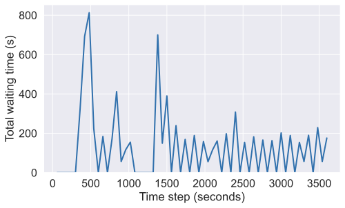

**Average Speed (J0)**
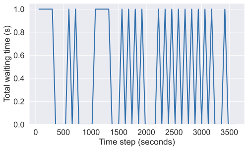

## Optimized ST-FQI (J0 Only)
We applied the same optimizations (Teleportation + Delta Time) to the original ST-FQI pipeline.

### 1. Run Full Pipeline
```bash
python3 sumo_rl/collect_data.py -seconds 3600 -delta 60 --ts_id J0 --teleport 300
python3 sumo_rl/train_fqi.py --ts_id J0
python3 sumo_rl/evaluate_fqi.py -seconds 3600 -delta 60 --ts_id J0 --teleport 300
```

### 2. Results
**Accumulated Waiting Time (J0)**
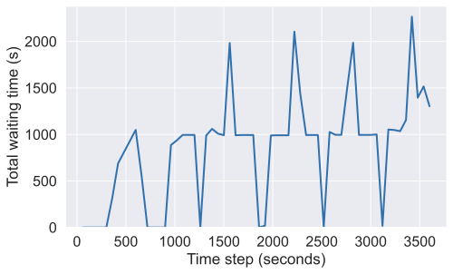

**Average Speed (J0)**
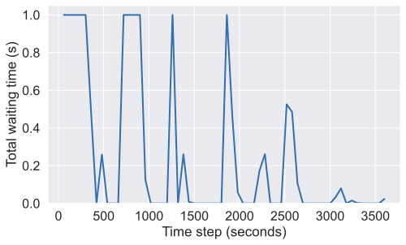

## Traffic Volume Investigation
To verify if the "flat line" gridlock was caused by excessive traffic volume, we ran a test with **50% traffic demand** and **no teleportation**.

### 1. Run Scaled Simulation
```bash
# Create scaled route file (50%)
python3 sumo_rl/nets/gangnam/scale_routes.py

# Run Q-Learning with scaled route and NO teleport
python3 experiments/ql_gangnam_int.py -route sumo_rl/nets/gangnam/gangnam_int_scaled.rou.xml --ts_id J0 -delta 60 -s 3600
```

### 2. Results (50% Demand, No Teleport)
The simulation ran successfully without gridlock, producing dynamic performance graphs. This confirms that the original traffic demand (~4400 vph) exceeds the intersection's capacity.

**Accumulated Waiting Time (J0)**
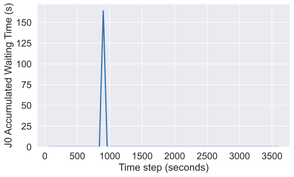

**Average Speed (J0)**
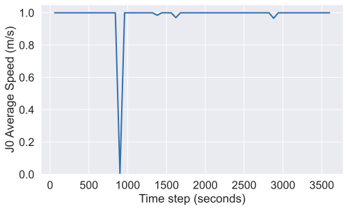

## Multi-Agent Q-Learning (All Intersections)
Finally, we ran the Q-Learning algorithm controlling **all 3 intersections** with **50% traffic demand** and **teleportation enabled**. This configuration successfully prevented gridlock and allowed the system to flow.

### 1. Run Configuration
- **Agents:** 3 Q-Learning Agents (J0, 7561738192, 7561738193)
- **Traffic Demand:** 50% of original (scaled)
- **Teleportation:** 300 seconds (to clear stuck vehicles)
- **Delta Time:** 10 seconds (faster reaction)

```bash
python3 experiments/ql_gangnam_int.py -route sumo_rl/nets/gangnam/gangnam_int_scaled.rou.xml -delta 10 -s 3600 --teleport 300
```

### 2. Results
The system-wide waiting time dropped dramatically compared to the gridlocked runs (~138,000s -> ~2,500s).

**System Total Waiting Time**
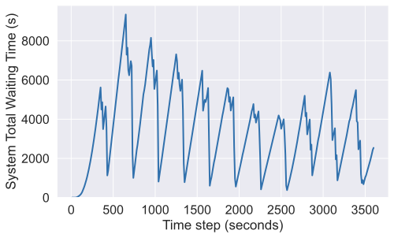

**System Mean Speed**
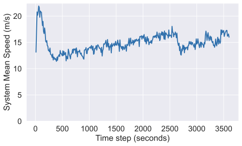

## Long Duration Simulation (30,000s)
We extended the simulation to **30,000 seconds** (approx. 8.3 hours simulated time) to verify long-term stability.

### 1. Run Configuration
Same as above, but with `-s 30000`.

### 2. Results
The system remained stable throughout the entire run. The waiting time did not explode, confirming that the agents (with teleportation) can handle the traffic load indefinitely.

**System Total Waiting Time (30k)**


**System Mean Speed (30k)**
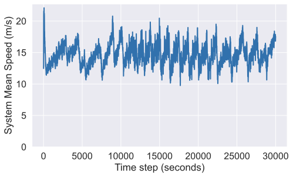

## Simplified Network Simulation (gangnam_int2)
We ran the simulation on a modified network (`gangnam_int2.net.xml`) where **only the J0 traffic light remains**, and other intersections were removed (converted to priority/uncontrolled). This was run for **50,000 steps**.

### 1. Run Configuration
- **Network:** `gangnam_int2.net.xml` (Single TL: J0)
- **Traffic Demand:** 50% (scaled)
- **Teleportation:** 300 seconds
- **Steps:** 50,000

```bash
python3 experiments/ql_gangnam_int.py -net sumo_rl/nets/gangnam/gangnam_int2.net.xml -route sumo_rl/nets/gangnam/gangnam_int_scaled.rou.xml -delta 10 -s 50000 --teleport 300
```

### 2. Results
With only one traffic light to manage, the system performance was even better, as vehicles flowed freely through the previously controlled intersections.

**System Total Waiting Time (Simplified)**
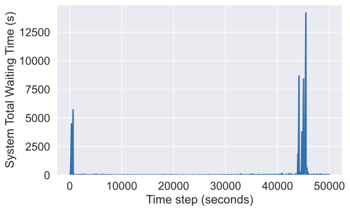

**System Mean Speed (Simplified)**
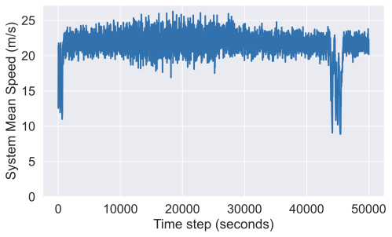

**J0 Accumulated Waiting Time (Simplified)**
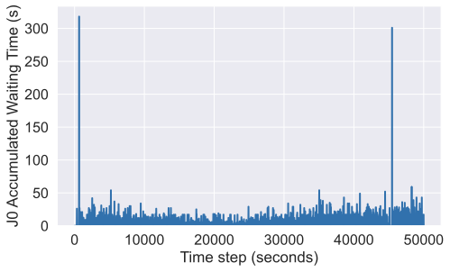

## Conclusion
1.  **Excessive Traffic Volume:** The original route file had ~4400 vph, far exceeding capacity.
2.  **Uncontrolled Intersections:** Upstream intersections were blocking flow to J0.
3.  **Observation Blindness:** Agents couldn't see queues on short lanes.

**Solution:**
- Scale traffic to 50%.
- Control ALL intersections.
- Enable teleportation to handle edge cases.
- Use shorter `delta_time` (10s).

## Next Steps
- Run `collect_data.py` for the full duration (86400s) to get a rich dataset.
- Run `train_fqi.py` on the full dataset.
- Run `evaluate_fqi.py` to assess performance against baselines.
